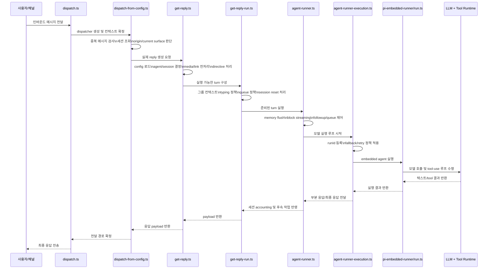

# OpenClaw 오케스트레이터 개요

## 짧은 결론

OpenClaw에는 시스템 전체를 통째로 지휘하는 단일 "오케스트레이터 LLM"이 없습니다.

상위 오케스트레이션은 대부분 TypeScript 애플리케이션 코드가 담당합니다.

- 인바운드 메시지 수신
- 세션/에이전트 라우팅 결정
- 정책, 전처리, 디렉티브 적용
- 실행 경로 선택
- 모델 실행과 fallback/retry 제어
- 최종 응답을 원래 표면으로 전달

LLM은 이 파이프라인 안에서 응답 생성과 tool-use를 수행하는 실행 엔진 역할을 하지만, 제품 전체의 최상위 컨트롤러는 아닙니다.

## 핵심 오케스트레이션 경로

인바운드 메시지 기준으로 가장 중요한 제어 흐름은 아래 순서입니다.

1. `src/auto-reply/dispatch.ts`
2. `src/auto-reply/reply/dispatch-from-config.ts`
3. `src/auto-reply/reply/get-reply.ts`
4. `src/auto-reply/reply/get-reply-run.ts`
5. `src/auto-reply/reply/agent-runner.ts`
6. `src/auto-reply/reply/agent-runner-execution.ts`
7. `src/agents/pi-embedded-runner/run.ts`

즉 "메시지가 들어왔다 -> 어떤 세션/에이전트가 처리할지 정한다 -> 모델을 돌린다 -> 응답을 보낸다" 흐름의 중심 축은 이 경로입니다.

## 시퀀스 다이어그램

## 레이어별 역할

### 1. Dispatcher 수명주기

`src/auto-reply/dispatch.ts`는 가장 바깥쪽 dispatch 래퍼입니다.

주요 역할:

- inbound context finalize
- reply dispatcher 생성/정리
- typing-aware buffered dispatch 구성
- 대기 중인 reply 작업 drain 보장

이 계층은 LLM 로직이 아니라 오케스트레이션 코드입니다.

### 2. 인바운드 제어 평면

`src/auto-reply/reply/dispatch-from-config.ts`는 가장 명확한 오케스트레이션 모듈 중 하나입니다.

주요 역할:

- 중복 인바운드 메시지 억제
- session store 조회
- originating channel 과 current surface 비교
- plugin/hook 통합
- TTS 및 reply delivery 정책 연결
- ACP dispatch 우회/사용 판단

즉, "이 메시지를 어디서 어떻게 처리하고 어디로 돌려보낼지"를 결정합니다.

### 3. 세션/모델/디렉티브 준비

`src/auto-reply/reply/get-reply.ts`는 실제 모델 실행 전 준비 단계의 중심입니다.

주요 역할:

- config 로드
- session key 기반 agent 결정
- workspace 준비
- media understanding / link understanding 전처리
- command authorization 검사
- session 초기화
- 기본 모델 결정
- channel 단위 모델 override 적용
- directive 파싱 및 inline action 처리

제품 관점에서 보면 가장 중요한 오케스트레이션 지점 중 하나입니다.

### 4. Turn 조립

`src/auto-reply/reply/get-reply-run.ts`는 실제 turn 컨텍스트를 구성합니다.

주요 역할:

- 그룹 채팅 컨텍스트와 intro 규칙 구성
- typing 정책 결정
- queue 정책 선택
- session reset notice 처리
- system/reset 이벤트 reply routing
- agent runner가 실행할 prompt/run 설정 패키징

이 단계도 여전히 규칙 기반 orchestration입니다.

### 5. 개별 reply run 조정

`src/auto-reply/reply/agent-runner.ts`는 단일 turn 실행의 운영 오케스트레이터에 가깝습니다.

주요 역할:

- active run queue 제어
- followup enqueue/drop 결정
- 실행 전 memory flush
- block streaming pipeline 구성
- typing signal 수명주기 관리
- 실행 후 accounting 및 followup 처리

### 6. retry/fallback 실행 루프

`src/auto-reply/reply/agent-runner-execution.ts`는 모델 실행 오케스트레이터라고 부르기 가장 좋은 파일입니다.

주요 역할:

- run ID 및 run context 등록
- `runWithModelFallback` 기반 provider/model fallback 제어
- embedded runtime 과 CLI runtime 분기
- partial streaming 처리
- tool result emission hook 연결
- transient HTTP retry 처리
- compaction 및 context overflow 복구

즉, 모델 실행 자체를 감싸는 제어 루프입니다.

### 7. Embedded agent runtime

`src/agents/pi-embedded-runner/run.ts`는 실제 agent 엔진을 구동하는 런타임입니다.

주요 역할:

- model/provider runtime 준비
- auth profile rotation/cooldown 처리
- context window guard 적용
- lane/queue 실행
- retry loop 수행
- compaction 처리
- oversized tool result 복구
- provider별 세부 런타임 처리

이 파일은 오케스트레이션 코드이면서도, LLM 실행부에 가장 가까운 계층입니다.

## LLM은 어디에 위치하는가

LLM은 상위 오케스트레이터가 아니라 agent runtime 내부에 들어 있습니다.

코드상 가장 강한 근거는 다음입니다.

- `src/agents/agent-command.ts`는 `@mariozechner/pi-coding-agent`의 `SessionManager`를 사용함
- `src/agents/pi-embedded.ts`는 `runEmbeddedPiAgent`를 재수출함
- `src/agents/pi-embedded-runner/run.ts`가 embedded Pi agent 실행을 담당함

즉, OpenClaw의 제어 흐름 안에서 모델은 "실행 엔진"으로 쓰입니다.

LLM이 담당하는 일:

- 응답 텍스트 생성
- tool 호출 여부 판단
- tool-use loop 내부 진행

LLM이 최상위로 담당하지 않는 일:

- ingress routing
- session ownership
- channel/origin reply routing
- queue/drop/followup 정책
- duplicate suppression
- typing behavior
- fallback 정책
- auth/profile rotation
- retry/backoff 정책
- delivery plumbing

이 부분은 OpenClaw 애플리케이션 코드가 소유합니다.

## 라우팅 관련 오케스트레이션

대화가 어느 agent/session에 붙을지를 정하는 별도 라우팅 레이어도 있습니다.

관련 파일:

- `src/routing/session-key.ts`
- `src/channels/plugins/registry.ts`
- `src/plugins/runtime.ts`

이 모듈들은 최상위 reply orchestrator는 아니지만, 다음 핵심 primitive를 제공합니다.

- session key 정규화
- agent 범위 결정
- plugin/channel registry 조회
- active plugin registry 상태 관리

## 실무적으로 어떤 파일을 오케스트레이터라고 부를 수 있나

질문이 "어느 모듈이 오케스트레이터냐"라면 가장 정확한 답은 아래입니다.

- 제품 수준 orchestration은 `src/auto-reply/reply/*` 파이프라인과 `src/agents/pi-embedded-runner/run.ts`에 분산되어 있다.
- reply orchestration 관점에서 가장 가까운 후보는 `src/auto-reply/reply/get-reply.ts`와 `src/auto-reply/reply/agent-runner-execution.ts`다.
- model runtime orchestration 관점에서 가장 가까운 후보는 `src/agents/pi-embedded-runner/run.ts`다.

즉, OpenClaw는 "LLM이 전체를 오케스트레이션하는 구조"가 아니라 "코드가 오케스트레이션하고 LLM이 그 안에서 실행되는 구조"로 보는 것이 맞습니다.
